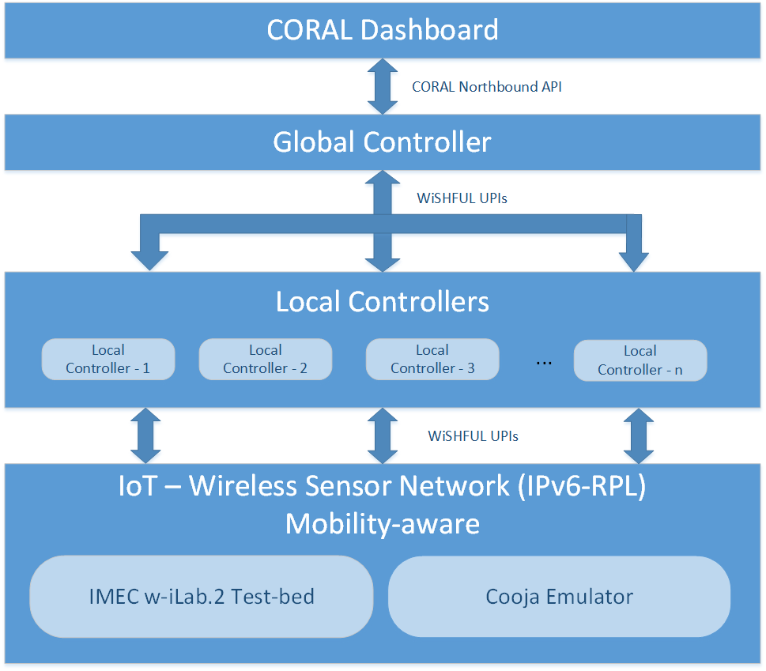
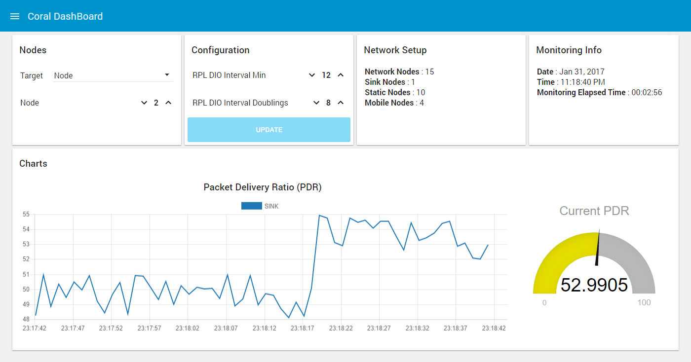

Wishful adapted code for running experiments with UPIs
This is an adapted version of the UPIs https://github.com/wishful-project 
WiSHFUL project information: http://www.wishful-project.eu/ 

If you found the code useful, please cite the paper(s) produced.
Find publications from this project, here:
http://uomcoral.wikispaces.com/Publications

Read more about it here: 
http://www.wishful-project.eu/software
https://wishful-project.github.io/wishful_upis/
1.	Various hacks and files to automate the running of experiments
install_wishful_environment : automates all the basic setup needed files and libraries
cooja.config : add the lines inside the cooja config file
cooja_run: just a script to run cooja from home (no need for cd…). If you have memory problems, use “ant run bigmem”, or “ant run big_mem”. (without the quotes “”)
createSerialPortSoftLinks : run this as root, AFTER you setup and RUN cooja. It will automatically connect the cooja emulated ports to wishful code
prepareWishFulTerminal: run this in EVERY new terminal window to make it wishful compatible (it installs pip3 python3, etc.…)
Essentials:
Ubuntu Linux (ver 16, 64 bit worked fine)
Wishful UPI libraries (the version included in this github)
Coral essential code (included in this github)
Coral Thread Socks Server (Included)
Node-red code (included)
Cooja emulator (part of the contiki 3.0 operating system)
Some cooja configurations are included as reference in the relative folder)

How to start an experiment:
All following need SEPARATE terminal windows. ( it means you will open some 10-15 different term windows)
Start node-red (terminal –run node-red. Obviously you need to install it)
Run the Java Server: java –jar coralThreadsSockServer.jar (find the right path)
Run cooja. Create (or open) an emulation, AND START IT! You can run it at 10% if you want to catch the beginning.
Run sudo ./createSerialPortSoftLinks to create the correct port links between wishful and cooja
You need one terminal for EVERY cooja emulated node. In every terminal, run ./prepareWishFulTerminal. It will take you to the 3-entitiles directory of coral. Then run the link for the wishful node (e.g. ./a1, or ./gcstart)

The first you need to run is the global controller. Run ./gcstart. It needs the following:
•	Connection with the Java server
•	Connection with node-red
•	Read the nodes.yaml file. Be careful: you need to declare as many Ip addresses as the nodes you are going to connect from cooja (if cooja has 5 nodes, you need five IP addresses, i.e. 127.0.0.1-5)
•	It will wait for ever for ALL the above. Be careful, you need to run the number of nodes described in nodes.yaml
If the global controller hangs, the most common reasons are;
	No connection with node-red
	No connection with Java server
	No correct configuration of cooja nodes, i.e. you didn’t execute correctly the connection of the cooja ports
	You didn’t start cooja (you have it on pause)
After the global controller starts, it will keep on printing messages on the terminal. It also creates several detailed log files in the folder ../logs. Check them carefuly.

Send questions to georgevio@gmail.com
Good luck

